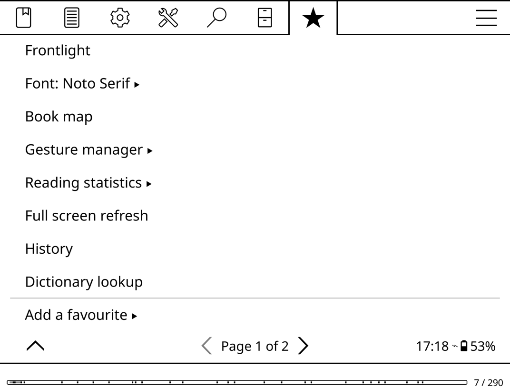
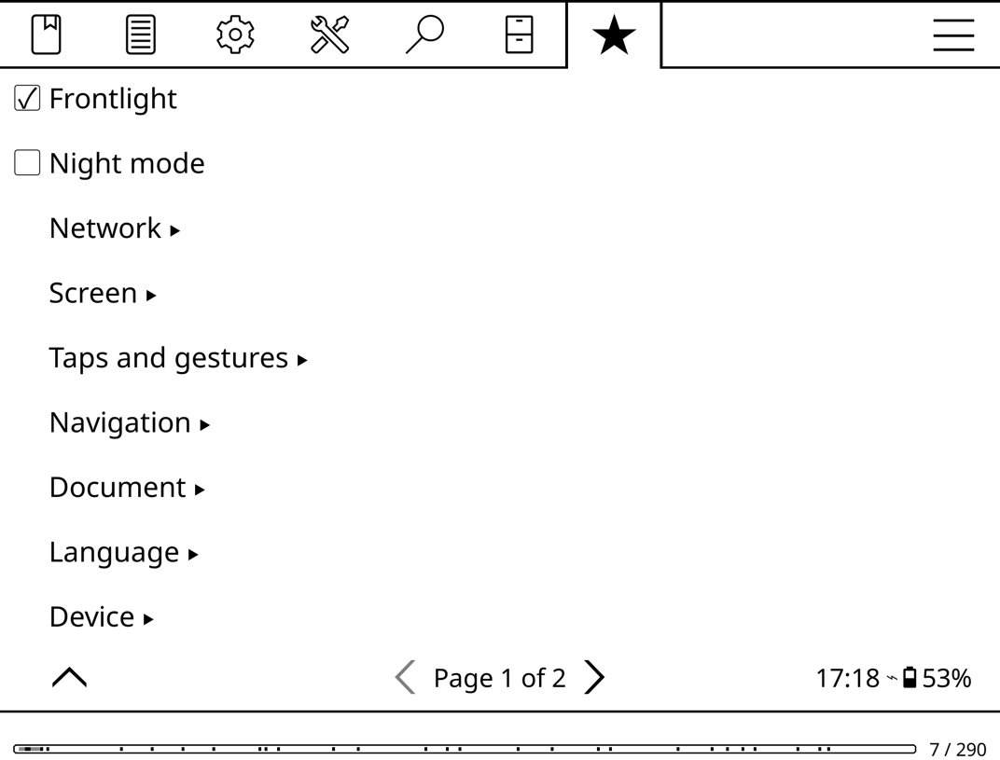
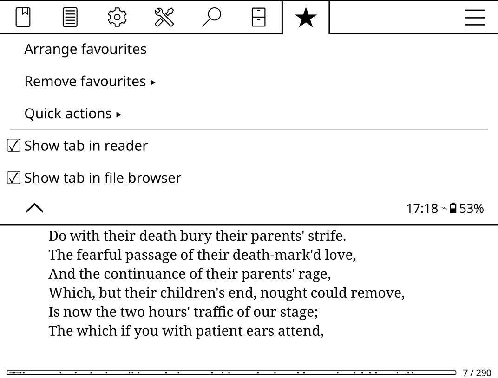
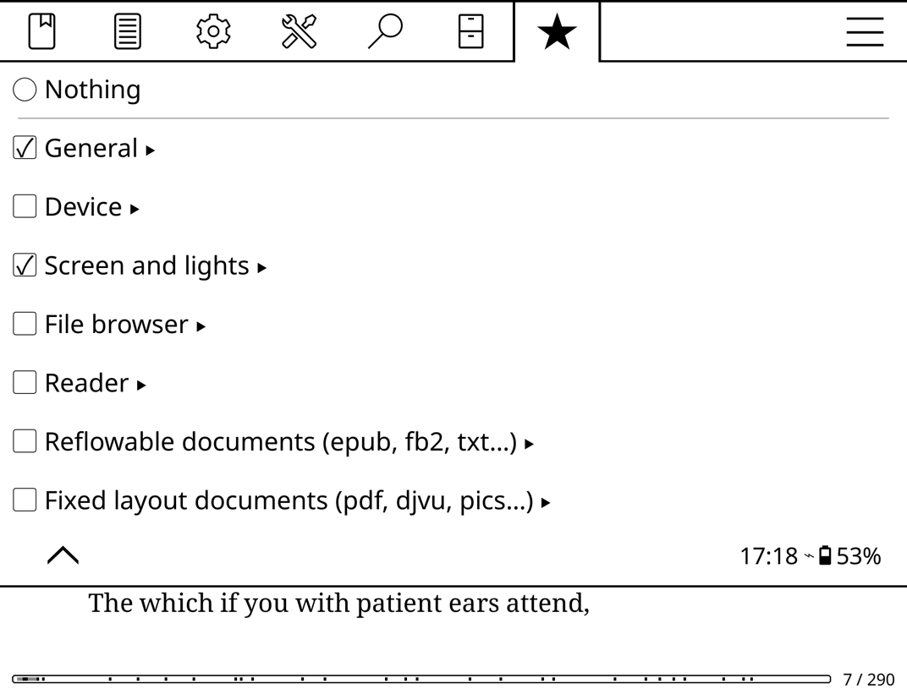

# Favourite settings

A KOReader plugin that adds a star tab to the top menu, holding the settings
you reach for often. They keep working exactly as they do in their own menu --
a checkbox is still a checkbox, a submenu still opens -- they are just one tap
away instead of three levels down.

The tab appears in the reader and in the file browser.

## Adding a favourite

**★ → Add a favourite** walks the same menu you already know, with a checkbox
on every entry. Tick one and it appears in the tab; untick it and it is gone.
Submenus can be starred too: open one and tick *Add "…" to favourites* at the
top.

Hold-to-favourite would have been tidier, but most menu entries already use
hold for something -- usually "set this as the default" -- so the browser stays
out of their way.

**★ → Manage favourites** holds the rest:

* **Arrange favourites** -- reorder them.
* **Remove favourites** -- ticked means kept; untick to remove. Tick again
  before leaving the submenu to change your mind.
* **Quick actions** -- the actions the Gestures and Profiles plugins offer, for
  things that are not menu entries at all (toggle frontlight, show the
  dictionary, and so on). Tick them by section; each one becomes its own entry
  in the tab and runs on its own, so the options Gestures has for running a
  *set* of actions together -- execution order, QuickMenu, and the rest -- are
  left out.

  

  An action that does not apply where you are -- a fixed-layout action while
  you are reading an epub, a reader action in the file browser -- is shown
  greyed out rather than doing nothing when tapped.
* **Show tab in reader / file browser** -- turn the tab off where you do not
  want it. The same menu stays reachable under *Tools → More tools → Favourite
  settings*, so there is always a way back.

There is also a **Show favourite settings** action for gestures and shortcuts,
which opens the menu straight onto the tab.

Anything in the menu can be starred, including entries other plugins add --
Terminal emulator, Read timer, Wallabag and so on -- which makes the tab a
launcher for the plugins you actually use as much as a settings shortcut.

## A favourite that is not available

A favourite is a reference to a menu entry, not a copy of a setting. Entries
that do not exist in the current context -- most reader settings, when you are
in the file browser -- are simply left out of the tab, and shown in *Remove
favourites* as "(not available here)".

The same applies to a plugin you have disabled: its favourite disappears from
the tab and comes back when you enable it again.

References survive a menu being reordered, an entry being renamed, and a
language change, though not all three at once; see the comments in
`favourites_menupath.lua` for what is matched and in what order. An entry that
cannot be recognised is dropped rather than guessed at, so a favourite never
quietly turns into a different setting.

## Files

| File | |
| --- | --- |
| `main.lua` | plugin lifecycle, the tab itself, and its contents |
| `favourites_menupath.lua` | referring to a menu entry, and finding it again |
| `favourites_store.lua` | the favourites list on disk |
| `favourites_picker.lua` | the "Add a favourite" browser |

Settings live in `settings/favourite_settings.lua` in KOReader's data
directory.

## Installing

Download the zip from the [latest
release](https://github.com/bitesized/favouritesettings.koplugin/releases/latest)
and unpack it into KOReader's `plugins/` folder, then restart KOReader.

The directory **must** be named `favouritesettings.koplugin`: KOReader only
looks at directories whose name ends in `.koplugin`, and silently ignores
everything else. The release zip already has the name right. GitHub's own
"Download ZIP" button does not -- it gives you
`favouritesettings.koplugin-main`, which KOReader will not load until you
rename it.

## How the tab gets there

KOReader builds its top menu by merging a flat table of entries against an
order table in `frontend/ui/elements/{reader,filemanager}_menu_order.lua`.
Those tables are `require`-cached, so a plugin can add to them -- the approach
`frontend/ui/plugin/insert_menu.lua` sanctions for "More tools", applied to the
top-level tab list instead. Two details matter:

* the tab needs an (empty) order list of its own, or `MenuSorter` treats it as
  a leaf and drops it;
* favourites can only be resolved once the menu has been sorted, so the plugin
  wraps `MenuSorter:mergeAndSort` to fill the tab immediately afterwards.

None of this is a published plugin API, so an upstream change to `MenuSorter`
could break it.
